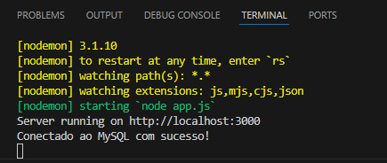
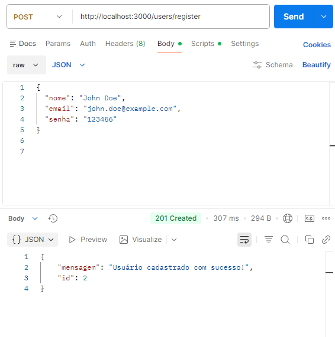
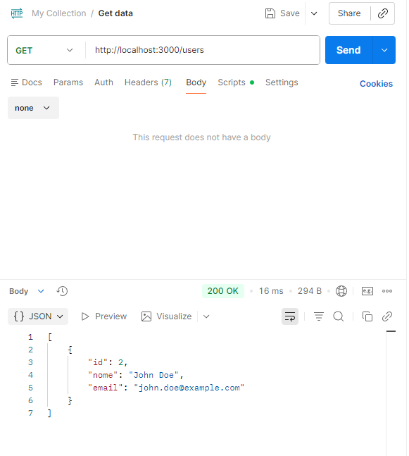

<h1>📌 Projeto: API de Usuários com Node.js & Express</h1> 
📖 Descrição 
Este projeto consiste em uma API RESTful desenvolvida em Node.js utilizando o framework Express, integrada a um banco de dados MySQL. O sistema implementa autenticação com JWT, criptografia de senhas com bcrypt, proteção contra ataques de força bruta com rate limiting e boas práticas de segurança como sanitização e validação de entradas.

## 📸 API Demonstration
### Server Running

### User Registration

### User Login (JWT)

### User READ

<h2>🔐 User Authentication API </h2>
API REST desenvolvida em Node.js para gerenciamento de usuários, com foco em segurança, boas práticas e autenticação JWT. 
Este projeto implementa um CRUD completo de usuários com proteção contra ataques comuns como SQL Injection, XSS, Brute Force e DoS, além de criptografia de senhas. 
 

<h2>🚀 Tecnologias Utilizadas: </h2>
✔Node.js 
✔Express 
✔MySQL 
✔bcrypt 
✔JSON Web Token (JWT) 
✔express-validator 
✔express-rate-limit 
✔dotenv 
 
<h2>📌 Funcionalidades </h2>
✔Cadastro de usuários 
✔ com autenticação JWT 
✔Listagem de usuários 
✔Busca por ID 
✔Atualização de dados 
✔Remoção de usuários 
✔Criptografia de senha 
✔Validação de dados 
 
Proteção contra: 
✔SQL Injection 
✔XSS 
✔Brute Force 
✔DoS 
✔Emails duplicados 
 
<h2>🔒 Segurança Implementada</h2>
 
✔Hash de senha com bcrypt 
✔Queries parametrizadas (SQL Injection) 
✔Sanitização de inputs (XSS) 
✔Rate Limit global (DoS) 
✔Rate Limit específico para login (Brute Force) 
✔Validação de dados com express-validator 
✔Variáveis de ambiente para dados sensíveis 
 
<h2>⚙️ Configuração do Ambiente</h2>
 
Crie um arquivo .env na raiz do projeto: 
DB_HOST=localhost 
DB_USER=root 
DB_PASSWORD=12345 
DB_NAME=sistema_cadastro 
SECRET_KEY=sua_chave_secreta 
 
<h2>📦 Instalação </h2>
npm install 

<h2>▶️ Executar o projeto </h2>
node app.js 

Servidor rodando em: 
http://localhost:3000 
 
<h2>📚 Rotas da API </h2>
🔹 Cadastro de usuário 
POST /users/register 
🔹 Login 
POST /users/login 
🔹 Listar usuários 
GET /users 
🔹 Buscar usuário por ID 
GET /users/:id 
🔹 Atualizar usuário 
PUT /users/:id 
🔹 Remover usuário 
DELETE /users/:id 
 
<h2>🗄️ Estrutura do Projeto: </h2>
<h2>📂 Estrutura </h2>
Código 
├── app.js 
├── routes/ 
│ └── userRoutes.js 
├── controllers/ 
│ └── userController.js 
├── models/ 
│ └── db.js 
├── middlewares/ 
│ ├── limiters.js 
│ └── validator.js 
└── package.json
 

<h2>📈 Objetivo do Projeto </h2>
Este projeto foi desenvolvido para: 
Praticar APIs REST 
Aplicar conceitos de segurança 
Demonstrar boas práticas de backend 
Servir como portfólio para vagas de Desenvolvedor Júnior 

<h2>👨‍💻 Autor </h2>
Rikael Ribeiro
Desenvolvedor em formação focado em backend, segurança e boas práticas.

<h2>⭐ Considerações Finais </h2>
Este projeto demonstra: 
✔ Organização de código 
✔ Segurança 
✔ Boas práticas 
✔ Conhecimento real de backend 

Ideal para portfólio e entrevistas técnicas.
